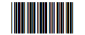
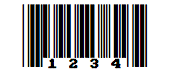
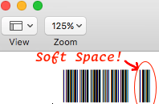

font-code3of9
=============
**Code 3 of 9 Font**

A PHP code that generates FontForge source for a Code 3 of 9 Font set.

Code 3 of 9 is one of the most common barcodes in use today, and thus virtually every barcode scanner will be capable of reading Code 3 of 9.

Each barcode character is made up of 9 bars, in a black white back white ... sequence.
_(The character will therfore have 5 black bars.)_
Of the 9 bars, 3 will be thicker than the others.  These "thicker" bars can be either black (bars) or white (spaces).  General rule is that the thicker bars are 3x thicker than the normal bars.

The font comes in two "weights", namely regular and bold.

* The regular font renders the barcode encoding.

  

* The bold font renders the barcode and human readable encoding.

  

  The "bold" version is not bolder or thicker, it just renders differently.
  This saves you from having a long list of font variants in your font selection drop-downs of your favorite editor.  This also allows you to change the look of the font, with some parts bolded (for human readable text), and others as regular (for start/stop and checksum)


How to compile and generate
---------------------------

* On OSX, use `./build.sh` to generate *.sfd* source files.

* Use FontForge (<http://fontforge.github.io>) to generate the font *.otf* file.

  Select _"OpenType (CCF)"_ when you "Generate Fonts..."

* _Hint:_ To reinstall fonts in OSX, remember to clear the font cache:

  `sudo atsutil databases -remove`


How to use the fonts
--------------------

* The font is called _'Code 3 of 9'_ once installed.  Select the text you need to encode and apply that font.

* Remember most bar codes have a leader and trailer (start annd stop) surrounding the data to encode.
With _3 of 9_ this is the ascii `*` _(asterisk)_ character.  So to encode _'1234'_ you will need to encode it as:

  `*1234*`

  You can also use parenthesis, brackets, braces or less-that/greater-than pairs:

  `(1234)`
  `[1234]`
  `{1234}`
  `<1234>`

  These sets do not have the human-readable `*` in the bold font. _(As per above example image.)_

* Also remember that bar codes need a quite zone on either side.  The quite zone must be clear of any markings,
as lines near the start and stop character will lead to unreadable scans.
You can use any of the non-Code 39 characters, for example the `_` _(underscore)_ character.

  So to encode _'1234'_ with a sufficient quite zone you will need to encode it as:

  `_*1234*_`

  In Excel, or Numbers, you can use the formula:

  `=CONCATENATE("_(", A1, ")_")
  ` _(Where 'A1' is the cell-ref of the unmodified data to encode.)_

* Code 3 of 9 can only encode the following characters:

  ```
  A B C D E F G H I J K L M N O P
  0 1 2 3 4 5 6 7 8 9 0
  $ % . / + - *
  ```
  and *Space*

  Therefore lower case alphabet symbols will encode as their uppercase counterparts.

Common problems
---------------

* In some text editors (like Word and Pages), if you type `*`'s around text the editor will assume to bold the text.
This will remove the asterisk and apply the bold-ing.  You can either roll-back/undo to revert the auto-bold, or use the `!` _(exclamation)_ character instead of the `*`.  e.i.:

  `!1234!`

* Also, these editors will apply a _"soft space"_ at the end of each line. The bar code will thus render as:
  

  This happens because those editors apply a "virtual" space character to signify a End Of Line.
  To get around the problem you can try:
  * Add an extra space after the barcode, and then apply a standard font to it.
  * Apply the _Code 3 of 9_ font only to the encodable characters, not the whole line.
  You will see when highlighting the text that it will highlight beyond the text.  You will need to manually bring back the highlight by one character before applying the font selection.


Finally
-------

* Licensed with the MIT License, so this font is free, as in _'libre'_.  So you have the freedom to use for any purpose as well as to study, change, and distribute and adapt, without attribution.

* If you do adapt _(and wish to contribute to the original project)_ or see changes you would like done, then can contact the author at:
  <http://vinorodrigues.com>


---
